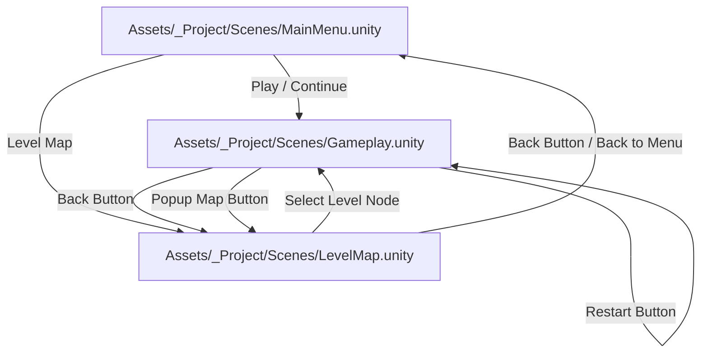

# 📊 Comprehensive System & Architecture Report: Tap Away Cars

**Document Version:** 1.6.0  
**Last Updated:** August 27, 2026  
**Target Repository:** `/Users/aryankinha/Documents/Aryan/Unity/arrowMaze`  
**Engine & Platform:** Unity 6000.5.8f1 (6000.5.8f1-5cb7df797b7d) | macOS / iOS / Android  

---

## 1. Executive Summary

**Tap Away Cars** is a commercial-grade 2D mobile traffic-clearing puzzle game built in Unity 6. 

The game combines directional puzzle mechanics with a polished cartoon traffic theme:
* **The Core Loop:** Players clear a crowded grid of cartoon cars by tapping them in the correct sequence.
* **Interlinked & Crossing Maze Topology:** Level generation and authored catalogs enforce mathematical guarantees that car routes share cells and cross perpendicularly (`minimumInterlinkFraction >= 0.40`, `minimumCrossFraction >= 0.15`), preventing trivial parallel "private lane" layouts while guaranteeing 100% puzzle solvability via reverse-clear search proofs (`ChainPuzzleSolver`).
* **Movement & Routing:** Tapped cars drive forward along asphalt lanes toward perimeter **EXIT gates**, accelerating and traveling completely beyond the camera viewport before completing departure.
* **Obstruction & Lives:** If a car's path is blocked by another vehicle, it performs an isolated horizontal shake with a red collision flash, deducting 1 Heart Life (3 Max) and triggering tactile audio/haptic feedback.
* **Boosters & Meta:** Players can use **Hints 💡** to highlight unblocked vehicles with a pulsing selection ring, **Undo ↺** to rewind previous moves, progress through a 23-level authored and procedural campaign catalog, and earn up to 3 stars per level saved via local persistence.
* **Cohesive Mobile Design System:** The entire application (Main Menu, Level Map, Gameplay, and Settings) adheres to a unified visual language:
  * **Main Menu:** Full-screen illustrated highway background (`main_menu_bg.png`), 3D extruded logotype (`logo_tap_away_cars.png`), animated 3/4 perspective hero cars showcase (`car_red_hero.png`, `car_yellow_hero.png`, `car_purple_hero.png`, `car_blue_hero.png`), dynamic CONTINUE/PLAY CTA, and live progress summary.
  * **Level Map:** 23-level winding road saga progression map with road tracks, dynamic level nodes (Current with car badge & glow pulse, Completed with 1–3 gold stars, Locked), auto-scrolling to the player's active level.
  * **Gameplay:** Clean responsive HUD (`#F4F7FC` background), card frame, autotiling modular roads, top-down cars, perimeter exit gates, Hint & Undo controls, and victory/defeat popup modals.
  * **Settings Modal:** Centralized settings overlay across all scenes supporting Sound Effects toggle, Haptics toggle, and Reset All Progress with confirmation dialog.

---

## 2. Unity Project Configuration & Environment

| Configuration Area | Specification / Setting | Notes / Details |
|---|---|---|
| **Unity Version** | `6000.5.8f1` | Unity 6 release with C# 9+ and incremental GC |
| **Render Pipeline** | Universal Render Pipeline (`com.unity.render-pipelines.universal` v17.5.0) | 2D Renderer (`Renderer2D.asset`) optimized for mobile Sprite and Canvas rendering |
| **Input System** | Unity Input System (`com.unity.inputsystem` v1.20.0) | Touchscreen primary touch, mouse click, and safe-area pointer raycasting |
| **UI Framework** | Unity UI (uGUI v2.5.0) & TextMeshPro (`com.unity.ugui`) | Vector-sharp typography, responsive layout anchors, and dynamic notch fitting |
| **Test Framework** | Unity Test Framework (`com.unity.test-framework` v1.7.0) | NUnit EditMode test runner for 100% puzzle solvability, interlink topology, lives, validator, & progress verification |
| **Target Orientation** | Portrait (9:16 / 1080×1920 reference) | Dynamic orthographic camera fitting with safe-area reserves (`SafeAreaFitter.cs`) |

---

## 3. Assembly Definition Architecture

The project codebase is partitioned into three explicit, modular Assembly Definitions:

```
Assets/_Project/
├── Scripts/
│   ├── ArrowMaze.Runtime.asmdef      (Root: ArrowMaze, References: Unity.InputSystem, UnityEngine.UI, Unity.TextMeshPro)
│   └── Editor/
│       └── ArrowMaze.Editor.asmdef   (Root: ArrowMaze.Editor, References: ArrowMaze.Runtime, Unity.TextMeshPro, UnityEngine.UI)
└── Tests/EditMode/
    └── ArrowMaze.EditModeTests.asmdef (Root: ArrowMaze.Tests, References: ArrowMaze.Runtime, UnityEditor.TestRunner, UnityEngine.TestRunner)
```

* **`ArrowMaze.Runtime`**: Core puzzle algorithm, interlinking topology analyzer, gameplay controllers, data catalogs, player progress, meta UI controllers, audio feedback system, and reusable modal components.
* **`ArrowMaze.Editor`**: Editor tooling, automated scene builders (`Tools/Rebuild All Meta Screens`, `Tools/Rebuild Main Menu UI`, `Tools/Rebuild Level Map UI`, `Tools/Rebuild Gameplay UI`, `Tools/Capture Screen Preview`), and menu utilities.
* **`ArrowMaze.EditModeTests`**: Isolated test harness executing deterministic puzzle generation, solver validation, interlink topology constraints, lives manager logic, path validation, progress persistence, and headless test automation (`Audit/Run EditMode Tests`).

---

## 4. Scene & Navigation Flow

The game is structured across three dedicated scenes:



1. **`MainMenu.unity`**: Title hub featuring the full-screen illustrated backdrop, 3D game logo, idle floating hero car animation, dynamic CONTINUE / PLAY button, Level Map navigation button, Settings button, Daily Reward button, and live progress summary (Level & Stars earned).
2. **`LevelMap.unity`**: 23-level winding road saga map displaying level node states (Current with car marker, pulsating glow, & "CURRENT" pill; Completed with 1–3 gold stars; Locked), auto-scrolling to the player's active level, with a header Back button and footer "BACK TO MENU" CTA.
3. **`Gameplay.unity`**: Core gameplay screen with responsive HUD, board frame, live cars, autotiled modular roads, perimeter EXIT gates, live car counter, 3 animated hearts, Hint button with count badge, Undo button, and victory/defeat popup modals.

---

## 5. Asset Inventory & Resources

### 🚗 Hero & Showcase Assets (`Assets/_Project/Sprites/Hero/`)
* `main_menu_bg.png`: Full-screen portrait illustrated highway receding toward a distant cartoon city skyline with trees and blue sky.
* `car_red_hero.png`: 3/4 front-facing red sports coupe with racing stripes and glowing headlights (center hero vehicle).
* `car_yellow_hero.png`: 3/4 front-facing yellow sports coupe (left hero vehicle).
* `car_purple_hero.png`: 3/4 front-facing purple sports coupe (right hero vehicle).
* `car_blue_hero.png`: 3/4 front-facing blue sports coupe (background hero vehicle and quest watermark).

### 🚗 Gameplay Cars (`Assets/_Project/Sprites/Cars/` & `Resources/Sprites/Cars/`)
* `car_blue.png`, `car_red.png`, `car_yellow.png`, `car_green.png`, `car_purple.png`
* Top-down cartoon sports cars with windshield highlights, headlights, and rear hazard lights used on the puzzle board.

### 🛣️ Modular Roads (`Assets/_Project/Sprites/Roads/` & `Resources/Sprites/Roads/`)
* `road_straight_v.png` & `road_straight_h.png`: Straight asphalt lanes with dashed white centerlines.
* `road_corner_0.png`, `road_corner_90.png`, `road_corner_180.png`, `road_corner_270.png`: 90-degree curve corners.
* `road_t_junction.png`, `road_crossroad.png`, `road_end.png`: Multi-lane intersections and dead ends.

### 🚧 Props & Board Decor (`Assets/_Project/Sprites/Props/` & `UI/`)
* `exit_gate.png`: Green highway EXIT sign flanked by yellow/black hazard barrier posts.
* `card_board_bg.png`: 9-sliced rounded white board card container with soft drop shadow.
* `selection_glow.png`: Concentric glowing pulse ring for hint targeting.
* `hand_pointer.png`: Animated tutorial hand pointer.

### 📱 UI Sprites (`Assets/_Project/Sprites/UI/`)
* `logo_tap_away_cars.png`: 3D extruded "TAP AWAY CARS" title logotype with gradient fill and depth shadow.
* `heart_full.png` / `heart_empty.png`: High-gloss 3D shaded red hearts for lives tracking.
* `star_full.png` / `star_empty.png`: Crisp gold and silver-gray star icons for node & level victory ratings.
* `button_circle.png`: Rounded circular white action button backing.
* `badge_pill.png`: 9-sliced rounded pill container for counters, difficulty badges, and CTAs.
* `icon_back.png`, `icon_settings.png`, `icon_car_badge.png`, `icon_hint.png`, `icon_undo.png`, `icon_play.png`, `icon_map_pin.png`, `icon_medal_ribbon.png`, `icon_gift.png`: Vector UI glyphs.

### 🔊 Audio Feedback (`Assets/_Project/Resources/Audio/Feedback/`)
* `click_002.ogg`: Clean UI button click / navigation sound.
* `select_003.ogg`: Car launch / movement sound on correct tap.
* `error_005.ogg`: Car blocked collision bump sound.
* `confirmation_002.ogg`: Level win / victory chime.
* `back_001.ogg`: Car exit gate departure / navigation back sound.
* `toggle_001.ogg`: Settings toggle switch click.
* *License:* Creative Commons CC0 1.0 Universal ([`THIRD_PARTY_NOTICES.md`](file:///Users/aryankinha/Documents/Aryan/Unity/arrowMaze/Assets/_Project/Audio/THIRD_PARTY_NOTICES.md)).

---

## 6. Codebase Architecture & File-by-File Audit

### 📁 `Assets/_Project/Scripts/Core/`

#### 1. [`ChainPuzzleSolver.cs`](file:///Users/aryankinha/Documents/Aryan/Unity/arrowMaze/Assets/_Project/Scripts/Core/ChainPuzzleSolver.cs)
* **Classes:** `ChainPuzzleSolveResult`, `ChainPuzzleSolver` (static).
* **Responsibility:** Independent backtracking search engine acting as generation's ground-truth acceptance gate.
* **Key Mechanics:** Explores legal tap sequences, tracks visited states with compact string bitmask hashing (`BuildStateKey`), and respects a hard state budget (default 250,000 states) to prevent hangs on unsolvable configurations.

#### 2. [`GridManager.cs`](file:///Users/aryankinha/Documents/Aryan/Unity/arrowMaze/Assets/_Project/Scripts/Core/GridManager.cs)
* **Responsibility:** World-space puzzle layout, orthographic camera framing, tile instantiation, board background card scaling, and perimeter exit gate placement.
* **Camera & Safe Area:** `FrameGridInCamera()` dynamically calculates safe area insets (`headerReserve = 2.8f`, `footerReserve = 1.6f`) to ensure the board is centered and never clips with UI overlays. Keeps EXIT signs upright across all boundaries.

#### 3. [`MazeGenerator.cs`](file:///Users/aryankinha/Documents/Aryan/Unity/arrowMaze/Assets/_Project/Scripts/Core/MazeGenerator.cs)
* **Types & Models:**
  * `ArrowDirection` enum (`Up`, `Right`, `Down`, `Left`).
  * `GridCoordinate` (immutable struct with equality operators).
  * `MazeLevel` (immutable board state holding directions, car occupancy matrix, construction order, trap coordinates, and seed; provides `CopyDirectionMatrix()` and `CopyCarMatrix()`).
  * `MazeGenerationSettings` (includes `MinimumInterlinkFraction = 0.40f` and `MinimumCrossFraction = 0.15f`).
  * `MazeGenerator` (static).
* **Algorithm & Interlink Optimization:**
  * Builds solvable levels in reverse clear order, strategically introduces trap configurations, and enforces target branching factors.
  * **Interlink Topology Analysis:** `ComputeSharedPathFraction()` and `ComputeCrossPathFraction()` geometrically measure path sharing and perpendicular crossings across all vehicles.
  * **`RaiseInterlinking()`:** Deterministically rewrites car directions to maximize crossings while provably preserving an existing known solution sequence, keeping trap constraints intact, and ensuring at least two legal opening moves.
  * Rejects candidate levels that fail to meet `MinimumInterlinkFraction` or `MinimumCrossFraction`, eliminating isolated parallel-lane layouts.

#### 4. [`PathValidator.cs`](file:///Users/aryankinha/Documents/Aryan/Unity/arrowMaze/Assets/_Project/Scripts/Core/PathValidator.cs)
* **Responsibility:** Real-time state machine for live gameplay validation and move management.
* **Features:** Tracks `TotalCars`, `ClearedCount`, and `RemainingCars`. Dispatches `OnCorrectTap`, `OnIncorrectTap`, `OnUndo`, and `OnLevelCompleted`. Manages the Undo history stack (`TryUndo`) and dynamic hint resolution (`GetHint`).

#### 5. [`RoadTopology.cs`](file:///Users/aryankinha/Documents/Aryan/Unity/arrowMaze/Assets/_Project/Scripts/Core/RoadTopology.cs)
* **Types:** `RoadConnections` flag enum (`None`, `Up`, `Right`, `Down`, `Left`), `RoadExit` struct.
* **Responsibility:** Evaluates level car escape trajectories and constructs bitmask connectivity matrices and perimeter `RoadExit` markers.
* **Guarantee:** Visual road autotiling (curves, straights, junctions) is 100% mathematically synchronized with legal physical car escape routes.

#### 6. [`StraightLineLegality.cs`](file:///Users/aryankinha/Documents/Aryan/Unity/arrowMaze/Assets/_Project/Scripts/Core/StraightLineLegality.cs)
* **Responsibility:** Pure mathematical raycaster validating whether a car has an unobstructed straight path to an active `RoadExit` gate at the board perimeter.

---

### 📁 `Assets/_Project/Scripts/Gameplay/`

#### 7. [`LevelController.cs`](file:///Users/aryankinha/Documents/Aryan/Unity/arrowMaze/Assets/_Project/Scripts/Gameplay/LevelController.cs)
* **Responsibility:** Top-level gameplay orchestrator connecting `GridManager`, `LivesManager`, `PathValidator`, `GameplayHUD`, and audio feedback.
* **Flow:** Starts levels from `LevelSession.SelectedLevel`, handles correct/incorrect taps, triggers audio/haptics, calculates earned stars (3 stars for 0 mistakes, 2 stars for <=2 mistakes, 1 star otherwise), persists progress via `PlayerProgress.CompleteLevel()`, and waits for the final car exit animation before showing the victory popup.

#### 8. [`LivesManager.cs`](file:///Users/aryankinha/Documents/Aryan/Unity/arrowMaze/Assets/_Project/Scripts/Gameplay/LivesManager.cs)
* **Responsibility:** 3-life heart system (`maxLives = 3`). Deducts lives on blocked taps (`LoseLife()`) and fires `OnGameOver` when lives reach 0.

#### 9. [`TileController.cs`](file:///Users/aryankinha/Documents/Aryan/Unity/arrowMaze/Assets/_Project/Scripts/Gameplay/TileController.cs)
* **Internal Layers:** Child 0 (`Road`), Child 1 (`Glow`), Child 2 (`Car`).
* **Input & Animations:**
  * Uses Unity Input System (`Touchscreen.current` / `Mouse.current`) for pointer detection.
  * `ClearDriveRoutine`: Drives car forward along its direction vector past the EXIT gate with smooth acceleration and off-screen viewport bounds departure calculation.
  * `WrongTapRoutine`: Shakes **only** `carTransform.localPosition` horizontally with red tint (`#F44336`), leaving the underlying road static.
  * `HintGlowRoutine`: Pulses concentric selection ring (`selection_glow.png`) when Hint is triggered.

#### 10. [`TileVisualFactory.cs`](file:///Users/aryankinha/Documents/Aryan/Unity/arrowMaze/Assets/_Project/Scripts/Gameplay/TileVisualFactory.cs)
* **Responsibility:** Runtime asset cache and modular road piece selector.
* **Autotiling:** Dynamically selects `road_straight_v`, `road_straight_h`, `road_corner_0/90/180/270`, `road_t_junction`, `road_crossroad`, or `road_end` based on `RoadConnections`. Caches car sprites across 5 color themes (`blue`, `red`, `yellow`, `green`, `purple`), exit gates, glow rings, board cards, and heart sprites.

---

### 📁 `Assets/_Project/Scripts/Data/` & `Meta/`

#### 11. [`LevelCatalog.cs`](file:///Users/aryankinha/Documents/Aryan/Unity/arrowMaze/Assets/_Project/Scripts/Data/LevelCatalog.cs)
* **Types:** `LevelKind` enum (`Tutorial`, `Authored`, `Procedural`, `Challenge`), `LevelDefinition` class.
* **Catalog Architecture:** 23 level definitions with progressive difficulty and crossing complexity:
  * **Tutorial (Levels 1–3):** Single car exit (1×1), dual exits (1×2), and open lane clearing (1×3).
  * **Authored Interlinked (Levels 4–10):** Hand-crafted ring/spoke base layouts dynamically raised by `MazeGenerator.RaiseInterlinking` (with `minimumSharedFraction = 0.55` and `minimumCrossFraction = 0.45`), transforming simple layouts into complex intersecting mazes while preserving mathematical solvability:
    * Level 4: 2×2 Easy ("Find the exits around the board.")
    * Level 5: 3×3 Easy ("Lanes now cross - mind the traffic.")
    * Level 6: 3×4 Easy ("Crossing paths block each other.")
    * Level 7: 4×4 Easy ("Read crossings before you tap.")
    * Level 8: 4×5 Easy ("Intersections decide the order.")
    * Level 9: 5×5 Easy ("Busy crossroads ahead.")
    * Level 10: 5×6 Challenge ("The busiest junction yet.")
  * **Procedural Campaign (Levels 11–22):** Deterministic procedural generation (6×7 to 6×8 grids) enforcing trap densities (0.18–0.28), car densities (0.45), and interlinking/crossing topology floors.
  * **Challenge Showcase (Level 23):** 6×8 Challenge level (Seed 260816).

#### 12. [`PlayerProgress.cs`](file:///Users/aryankinha/Documents/Aryan/Unity/arrowMaze/Assets/_Project/Scripts/Meta/PlayerProgress.cs)
* **Data Models:** `LevelStarRecord`, `PlayerProgressData` (`highestUnlockedLevel`, `lastPlayedLevel`, `levelStars` list).
* **Responsibility:** Local save data persistence (`TapAwayCars.PlayerProgress.v1` in `PlayerPrefs`).
* **Capabilities:** Tracks unlocked levels, star ratings per level (0–3 ⭐), audio settings (`SoundEffectsEnabled`, `HapticsEnabled`), `GetContinueLevel()`, `GetTotalStarsEarned()`, `GetCompletedLevelsCount()`, and full data reset via `ResetAllProgress()`.

#### 13. [`LevelSession.cs`](file:///Users/aryankinha/Documents/Aryan/Unity/arrowMaze/Assets/_Project/Scripts/Meta/LevelSession.cs)
* **Responsibility:** Static session data bridge carrying `SelectedLevel` across scene transitions via `PlayerPrefs` (`TapAwayCars.SelectedLevel`).

---

### 📁 `Assets/_Project/Scripts/UI/`

#### 14. [`ButtonPressFeedback.cs`](file:///Users/aryankinha/Documents/Aryan/Unity/arrowMaze/Assets/_Project/Scripts/UI/ButtonPressFeedback.cs)
* **Responsibility:** Reusable tactile animation and sound dispatcher for all uGUI buttons. Animates scale to 0.96× on pointer down and smoothly returns to resting scale on release. Plays standard click or toggle sound via `GameFeedback`.

#### 15. [`GameFeedback.cs`](file:///Users/aryankinha/Documents/Aryan/Unity/arrowMaze/Assets/_Project/Scripts/UI/GameFeedback.cs)
* **Responsibility:** Persistent singleton audio source (`DontDestroyOnLoad`) managing low-latency SFX playback (`PlayButton`, `PlayToggle`, `PlayCarMove`, `PlayBlocked`, `PlayExit`, `PlaySuccess`). Automatically inspects loaded scenes and attaches `ButtonPressFeedback` to all buttons.

#### 16. [`GameplayHUD.cs`](file:///Users/aryankinha/Documents/Aryan/Unity/arrowMaze/Assets/_Project/Scripts/UI/GameplayHUD.cs)
* **Responsibility:** Live UI presentation controller binding Title, Level number, Car counter pill, 3 dynamic hearts with damage pulse animation, difficulty pill, Hint button (with live count badge), Undo button, `SettingsModal`, and victory/defeat popup modals with star reveals.

#### 17. [`MainMenuController.cs`](file:///Users/aryankinha/Documents/Aryan/Unity/arrowMaze/Assets/_Project/Scripts/UI/MainMenuController.cs)
* **Responsibility:** Main Menu controller managing idle hero car floating animations (sine wave vertical bobbing), dynamic PLAY / CONTINUE button label switching, Level Map scene loading, Settings modal, and quest/progress cards.

#### 18. [`LevelMapController.cs`](file:///Users/aryankinha/Documents/Aryan/Unity/arrowMaze/Assets/_Project/Scripts/UI/LevelMapController.cs)
* **Responsibility:** 23-level saga progression map controller. Wires header buttons, registers level nodes, scrolls smoothly to center the player's active level in the viewport, and dispatches level launches to `Gameplay.unity`.

#### 19. [`LevelNode.cs`](file:///Users/aryankinha/Documents/Aryan/Unity/arrowMaze/Assets/_Project/Scripts/UI/LevelNode.cs)
* **Responsibility:** Reusable node component for the Level Map supporting three distinct visual states:
  * **Current:** Blue node background (`#2F80ED`), white text, animated pulsating glow (`currentGlow`), top car marker (`car_yellow.png`), and "CURRENT" badge.
  * **Completed:** White node background (`#FFFFFF`), navy text (`#17233D`), and 3 gold star rating sprites (`star_full.png` / `star_empty.png`).
  * **Locked:** Slate node background (`#E2E8F0`), muted text, and lock icon.

#### 20. [`MenuUiBuilder.cs`](file:///Users/aryankinha/Documents/Aryan/Unity/arrowMaze/Assets/_Project/Scripts/UI/MenuUiBuilder.cs)
* **Responsibility:** Runtime utility helper for programmatic Canvas and uGUI element construction.

#### 21. [`SafeAreaFitter.cs`](file:///Users/aryankinha/Documents/Aryan/Unity/arrowMaze/Assets/_Project/Scripts/UI/SafeAreaFitter.cs)
* **Responsibility:** Dynamically adjusts UI RectTransform anchors to accommodate hardware notches, dynamic islands, and home indicator bars across mobile devices.

#### 22. [`SettingsModal.cs`](file:///Users/aryankinha/Documents/Aryan/Unity/arrowMaze/Assets/_Project/Scripts/UI/SettingsModal.cs)
* **Responsibility:** Reusable modal component for Main Menu, Level Map, and Gameplay.
* **Features:** Semi-transparent dark overlay, Sound Effects toggle (ON/OFF), Haptics toggle (ON/OFF), Reset All Progress button with secondary confirmation popup dialog, and `OnProgressReset` event dispatching.

---

### 📁 `Assets/_Project/Scripts/Editor/`

#### 23. [`MetaUIBuilder.cs`](file:///Users/aryankinha/Documents/Aryan/Unity/arrowMaze/Assets/_Project/Scripts/Editor/MetaUIBuilder.cs)
* **Responsibility:** Automated construction tool for `MainMenu.unity` and `LevelMap.unity`.
* **Menu Items:**
  * `Tools/Rebuild All Meta Screens`
  * `Tools/Rebuild Main Menu UI`
  * `Tools/Rebuild Level Map UI`
  * `Tools/Capture Screen Preview`
* **Features:** Constructs full-screen illustrated backgrounds, 3D game logo, 4-car hero showcase with 3/4 perspective car sprites, action buttons, progress bars, winding road tracks, and level nodes.

#### 24. [`GameplayUIBuilder.cs`](file:///Users/aryankinha/Documents/Aryan/Unity/arrowMaze/Assets/_Project/Scripts/Editor/GameplayUIBuilder.cs)
* **Responsibility:** Automated construction tool for `Gameplay.unity`. Accessible via `Tools/Rebuild Gameplay UI`. Builds header, status row, bottom controls, settings modal, and victory/defeat popups.

---

## 7. Reconstructed Meta UI Structures

### Main Menu (`MainMenu.unity`)
```text
Canvas (Screen Space - Camera, Scaler: 1080×1920, Match: 0.5)
 └── Safe Area (SafeAreaFitter)
      ├── Illustrated Background (Full-screen Sprite: main_menu_bg.png)
      ├── Bottom Overlay (Semi-transparent dark panel for UI readability)
      ├── SettingsButton (Circular 96×96, Top-Left, button_circle.png + icon_settings.png)
      │    └── Settings Label ("SETTINGS")
      ├── DailyRewardButton (Circular 96×96, Top-Right, button_circle.png + icon_gift.png)
      │    ├── NotifBadge ("!")
      │    └── Daily Label ("DAILY\nDAILY REWARD")
      ├── Game Logo (780×340 Sprite: logo_tap_away_cars.png, Y = 620)
      ├── Tagline (580×48 Pill, "Clear the traffic. One car at a time.", Y = 430)
      ├── Hero Cars (Showcase Container, Y = 130, Size: 1080×600)
      │    ├── Hero Car Blue (170×170, Background, car_blue_hero.png)
      │    ├── Hero Car Yellow (280×280, Left, car_yellow_hero.png)
      │    ├── Hero Car Purple (280×280, Right, car_purple_hero.png)
      │    └── Hero Car Red (380×380, Center Foreground, car_red_hero.png)
      ├── Exit Sign (100×52, exit_gate.png, Y = 350)
      ├── Quest Card (920×160, card_board_bg.png, Y = -115)
      │    ├── Medal Icon (85×85, icon_medal_ribbon.png)
      │    ├── Quest Label ("Continue")
      │    ├── Quest Subtitle ("Level X")
      │    ├── Quest Bar Bg & Green Bar Fill (Progress toward 23 levels)
      │    ├── Quest Stars Text ("X / 69 STARS")
      │    └── Watermark Car (car_blue_hero.png)
      ├── PlayContinueButton (920×130 Pill, Gold #FFBE21, "CONTINUE" / "LEVEL X", Y = -310)
      ├── LevelMapButton (920×114 Pill, Blue #2A7FEB, "LEVEL MAP", Y = -455)
      ├── Footer Progress Bar (920×88 Navy Card, "LEVEL X OF 23", "X / 69 STARS", Y = -590)
      └── Settings Modal (Overlay with toggles + Reset Progress subdialog)
```

### Level Map (`LevelMap.unity`)
```text
Canvas (Screen Space - Camera, Scaler: 1080×1920, Match: 0.5)
 └── Safe Area (SafeAreaFitter)
      ├── Background (Pale Blue #DEF6FF)
      ├── Header (Height: 142, Y = -24)
      │    ├── Header Backdrop
      │    ├── BackButton (Circular 92×92, button_circle.png + icon_back.png)
      │    ├── Title ("LEVEL MAP", 47pt Bold)
      │    ├── Subtitle ("Follow the road. Clear the traffic.", 24pt)
      │    └── SettingsButton (Circular 92×92, button_circle.png + icon_settings.png)
      ├── Map Scroll View (Clamped vertical ScrollRect, inertia enabled)
      │    └── Viewport (RectMask2D)
      │         └── Road Content (Height: 5280px)
      │              ├── Winding Road (Connected road_straight_v segments between nodes)
      │              └── Level Nodes 1..23 (Winding sine pattern: x = sin(i * 0.88 + 0.35) * 220)
      │                   ├── Button (Circular node background)
      │                   ├── Level Number ("1".."23", Bold text)
      │                   ├── Stars Container (3× star_full.png / star_empty.png sprites)
      │                   ├── Car Marker (Active on player's current level)
      │                   ├── Current Glow (Pulsing ring on player's current level)
      │                   ├── Status Badge ("CURRENT")
      │                   └── Lock Icon (Active on locked levels)
      ├── Back To Menu Button (650×102 Pill, Navy #14264E, Y = -840)
      └── Settings Modal (Overlay with toggles + Reset Progress subdialog)
```

### Gameplay Screen (`Gameplay.unity`)
```text
Canvas / HUD (Screen Space - Camera / Overlay, Scaler: 1080×1920, Match: 0.5)
 └── Safe Area (SafeAreaFitter)
      ├── Background (Transparent over camera Solid Color #F4F7FC)
      ├── Header (Height: 130, Y = -20)
      │    ├── BackButton (Circular 96×96, button_circle.png + icon_back.png)
      │    ├── TitleGroup ("Tap Away Cars", Subtitle: "Level X")
      │    └── SettingsButton (Circular 96×96, button_circle.png + icon_settings.png)
      ├── StatusRow (Height: 80, Y = -165)
      │    ├── CarCounterPill (210×74 Pill, icon_car_badge.png + "X" cars remaining)
      │    ├── Lives (230×74 HorizontalLayoutGroup, 3× heart_full.png / heart_empty.png)
      │    └── DifficultyPill (210×74 Pill, "Tutorial" / "Easy" / "Normal" / "Hard")
      ├── World Space Board (Rendered by Camera.main)
      │    ├── BoardCard (9-sliced card_board_bg.png scaled to level dimensions)
      │    ├── Tiles (Grid of Tile prefabs: modular road piece + top-down car + glow ring)
      │    └── ExitGates (exit_gate.png positioned at active perimeter exits)
      ├── BottomControls (Height: 200, Y = 48)
      │    ├── Hint Button (Circular 156×156, icon_hint.png + "Hint" + CountBadge "2")
      │    └── Undo Button (Circular 156×156, icon_undo.png + "Undo")
      ├── Result Popup (Animated CanvasGroup + Popup Card)
      │    ├── Popup Title ("LEVEL COMPLETE!" / "Out of Hearts")
      │    ├── Popup Message (Star string "★ ★ ★" / defeat subtext)
      │    ├── Popup Next Button ("NEXT LEVEL")
      │    ├── Popup Restart Button ("RETRY")
      │    └── Popup Map Button ("LEVEL MAP")
      └── Settings Modal (Overlay with toggles + Reset Progress subdialog)
```

---

## 8. Test Suite & Verification Matrix

### EditMode Test Fixtures (`Assets/_Project/Tests/EditMode/`)

| Test Fixture | Method / Scenario | Assertion & Validation | Result |
|---|---|---|---|
| **`InterlinkTopologyTests`** | `NonTutorialCatalogLevels_AreInterlinkedMazes_AndSolvable` | Validates all non-tutorial catalog levels (Levels 4–23); asserts 100% solvability, shared path fraction >= 40%, and crossing path fraction >= 15%. | PASS ✅ |
| | `FreshGeneratedLevels_AreInterlinkedMazes_AndSolvable` | Validates newly generated procedural levels across multiple seeds; asserts full solvability and crossing path topology constraints. | PASS ✅ |
| **`MazeGeneratorTests`** | `GeneratedMazes_AreSolvableAcrossOneHundredSeeds` | Validates 100 consecutive procedural seeds (6×8 grid); verifies 100% solvability with zero search-budget timeouts. | PASS ✅ |
| | `GeneratedMaze_RespectsRequestedDimensionsAndBranchingTarget` | Verifies dimensions (6×8), construction order length (48), and initial legal branching factor (>=2). | PASS ✅ |
| | `GeneratedMaze_WithTrapDensity_HasInitialIllegalTrapTiles` | Verifies active trap coordinates are blocked on initial state. | PASS ✅ |
| **`PathValidatorTests`** | `BoundaryArrow_IsLegalWhenItsStraightPathExits` | Validates boundary arrow exiting through perimeter gate. | PASS ✅ |
| | `ActiveTileInStraightLine_BlocksUntilItIsCleared` | Verifies blocking relationships and unblocking on clear. | PASS ✅ |
| | `FullClear_RaisesCompletionOnlyAfterEveryTileIsCleared` | Verifies `OnLevelCompleted` fires only when all cars are cleared. | PASS ✅ |
| | `EmptyRoads_DoNotBlockCarsAndSolverUsesTheSameBoardState` | Verifies empty road cells do not obstruct car trajectories. | PASS ✅ |
| | `Undo_RestoresTheCarAndItsBlockingRelationship` | Verifies undo pushes car back to board and restores blocking. | PASS ✅ |
| | `RoadTopology_EndsEachCarRouteAtItsActualExitGate` | Verifies road connections and exit gate placement match escape routes. | PASS ✅ |
| **`LivesManagerTests`** | `LoseLife_DecrementsExactlyOnceAndEndsAtZero` | Verifies life decrement from 3 to 0 and single `OnGameOver` event. | PASS ✅ |
| **`PlayerProgressTests`** | `NewPlayer_OnlyLevelOneIsUnlocked` | Verifies initial state unlocks only Level 1. | PASS ✅ |
| | `CompletingLevel_RecordsBestStarsAndUnlocksOnlyTheNextLevel` | Verifies star persistence (max stars) and sequential unlock. | PASS ✅ |
| | `CatalogLevels_AreDeterministicAndLevelTwentyThreeRemainsAvailableForDevelopment` | Verifies seed determinism across catalog levels. | PASS ✅ |
| | `FirstTenCatalogLayouts_AreFixedAndSolvable` | Verifies authored levels 1–10 solve successfully. | PASS ✅ |
| | `HapticsSetting_PersistsCorrectly` | Verifies haptics preference persistence. | PASS ✅ |
| | `SoundEffectsSetting_PersistsCorrectly` | Verifies sound effects preference persistence. | PASS ✅ |
| | `ProgressAggregation_CalculatesTotalStarsAndCompletedLevels` | Verifies total star aggregation and full progress reset. | PASS ✅ |
| **`AuditTestRunner`** | `Audit/Run EditMode Tests` | Test runner API callback execution writing real-time test run summaries to `Logs/audit-editmode-results.txt`. | TOOL ✅ |

---

## 9. Quality & Engineering Verification

* **Compiler Diagnostics:** Checked via Unity Editor — **0 active compilation errors, 0 active warnings**.
* **Play Mode Loop:** Full cross-scene navigation flow verified:
  * `MainMenu` -> `LevelMap` -> `Gameplay` -> Victory / Next Level / Back to `MainMenu` or `LevelMap`.
  * Settings modal opens, toggles sound effects and haptics, and resets progress with confirmation dialog.
  * Main Menu displays illustrated background, 3D logo, and live floating hero car animations.
  * Level Map auto-scrolls and highlights the player's active level with pulsating glow and car marker.
  * Gameplay HUD, 3-heart deduction on collision with shake & audio feedback, undo stack, hint highlighter, and exit animations function reliably.
* **EditMode Unit Tests:** Full coverage spanning puzzle generation, solver verification, crossing topology constraints, gameplay validation, and persistence.

---

*Report compiled and verified against the live Unity 6 codebase and project assets.*
