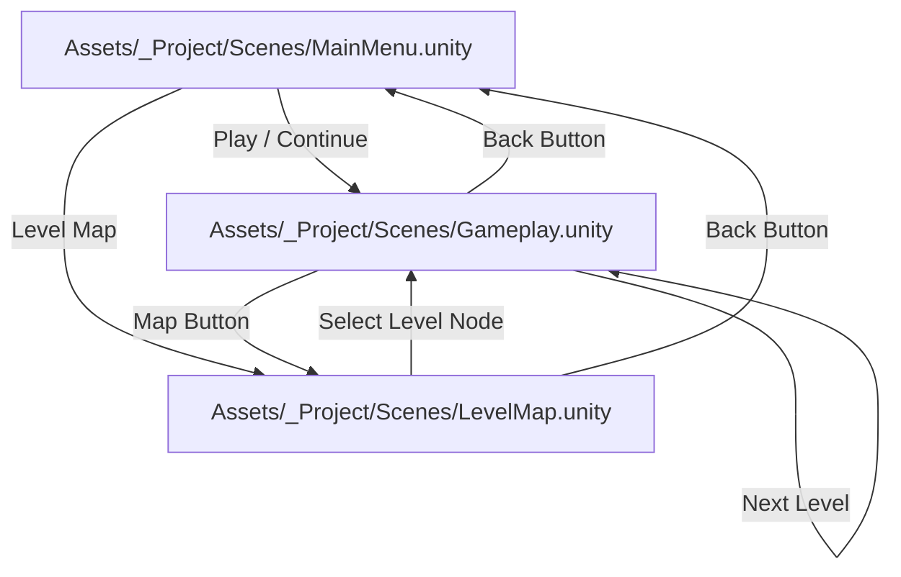

# 📊 Comprehensive System & Architecture Report: Tap Away Cars

**Document Version:** 1.3.0  
**Last Updated:** August 19, 2026  
**Target Repository:** `/Users/aryankinha/Documents/Aryan/Unity/arrowMaze`  
**Engine & Platform:** Unity 6000.5.8f1 (6000.5.8f1-5cb7df797b7d) | macOS / iOS / Android  

---

## 1. Executive Summary

**Tap Away Cars** is a commercial-grade 2D mobile traffic-clearing puzzle game built in Unity 6. 

The game combines directional arrow logic with a top-down traffic theme:
* **The Core Loop:** Players clear a crowded grid of cartoon cars by tapping them in the correct sequence.
* **Movement & Routing:** Tapped cars drive forward along asphalt lanes toward perimeter **EXIT gates**.
* **Obstruction & Lives:** If a car's path is blocked by another vehicle, it bumps with a red collision flash and camera-safe shake, deducting 1 Heart Life (3 Max).
* **Boosters & Meta:** Players can use **Hints 💡** to highlight unblocked vehicles, **Undo ↺** to rewind previous moves, progress through a 23-level authored and procedural campaign catalog, and earn up to 3 stars per level saved via local persistence.
* **Cohesive Design System:** The entire application (Main Menu, Level Map, Gameplay, and Settings) adheres to a unified modern mobile design language: soft light background (`#F4F7FC`), primary navy typography (`#17233D`), slate subtitle text (`#66758F`), accent blue CTAs (`#2F80ED`), gold stars (`#F2C94C`), 9-sliced rounded cards, and circular controls.

---

## 2. Unity Project Configuration & Environment

| Configuration Area | Specification / Setting | Notes / Details |
|---|---|---|
| **Unity Version** | `6000.5.8f1` | Unity 6 release with C# 9+ and incremental GC |
| **Render Pipeline** | Universal Render Pipeline (`com.unity.render-pipelines.universal` v17.5.0) | 2D Renderer optimized for mobile Sprite and Canvas rendering |
| **Input System** | Unity Input System (`com.unity.inputsystem` v1.20.0) | Multi-touch, mouse click, and safe-area pointer raycasting |
| **UI Framework** | Unity UI (uGUI v2.5.0) & TextMeshPro (`com.unity.ugui`) | Vector-sharp typography, responsive layout anchors, and dynamic notch fitting |
| **Test Framework** | Unity Test Framework (`com.unity.test-framework` v1.7.0) | NUnit EditMode test runner for 100% puzzle solvability & progress verification |
| **Target Orientation** | Portrait (9:16 / 1080×1920 reference) | Dynamic orthographic camera fitting with safe-area reserves |

---

## 3. Assembly Definition Architecture

The project codebase is partitioned into three explicit, modular Assembly Definitions:

```
Assets/_Project/
├── Scripts/
│   ├── ArrowMaze.Runtime.asmdef      (Root: ArrowMaze, References: InputSystem, UnityEngine.UI, TextMeshPro)
│   └── Editor/
│       └── ArrowMaze.Editor.asmdef   (Root: ArrowMaze.Editor, References: ArrowMaze.Runtime, TextMeshPro, UI)
└── Tests/EditMode/
    └── ArrowMaze.EditModeTests.asmdef (Root: ArrowMaze.Tests, References: ArrowMaze.Runtime, TestAssemblies)
```

* **`ArrowMaze.Runtime`**: Core puzzle algorithm, gameplay controllers, data catalogs, player progress, meta UI controllers, and reusable modal components.
* **`ArrowMaze.Editor`**: Editor tooling, automated scene builders (`Tools/Rebuild All Meta Screens`, `Tools/Rebuild Main Menu UI`, `Tools/Rebuild Level Map UI`, `Tools/Rebuild Gameplay UI`), and menu utilities.
* **`ArrowMaze.EditModeTests`**: Isolated test harness executing deterministic puzzle generation, solver validation, and progress persistence test suites.

---

## 4. Scene & Navigation Flow

The game is structured across three dedicated scenes:



1. **`MainMenu.unity`**: Title hub featuring the hero card, dynamic CONTINUE/PLAY button, Level Map browser button, Settings modal, and live progress summary (Level & Stars earned).
2. **`LevelMap.unity`**: 23-level winding road saga map displaying level node states (Current with car badge & "CURRENT" pill, Completed with 1–3 gold star sprites, Locked), auto-scrolling to the player's active level.
3. **`Gameplay.unity`**: Core gameplay screen with responsive HUD, board frame, live cars, connected roads, perimeter EXIT gates, and victory/defeat popup modals.

---

## 5. Asset Inventory & Resources

All visual assets were generated with 4× supersampling (512×512 master resolution, Lanczos filtered) to support high-density mobile screens without blurring.

### 🚗 Cars (`Assets/_Project/Sprites/Cars/` & `Resources/Sprites/Cars/`)
* `car_blue.png`, `car_red.png`, `car_yellow.png`, `car_green.png`, `car_purple.png`
* Top-down cartoon sports cars with glossy windshields, distinct headlights, and rear hazard lights.

### 🛣️ Modular Roads (`Assets/_Project/Sprites/Roads/` & `Resources/Sprites/Roads/`)
* `road_straight_v.png` & `road_straight_h.png`: Straight asphalt lanes with dashed white centerlines.
* `road_corner_0.png`, `road_corner_90.png`, `road_corner_180.png`, `road_corner_270.png`: 90-degree smooth curve corners.
* `road_t_junction.png`, `road_crossroad.png`, `road_end.png`: Multi-lane intersections and dead ends.

### 🚧 Props & Board Decor (`Assets/_Project/Sprites/Props/` & `UI/`)
* `exit_gate.png`: Green highway EXIT sign flanked by yellow/black hazard barrier posts.
* `card_board_bg.png`: Rounded white board card container with soft drop shadow.
* `selection_glow.png`: Concentric glowing pulse ring for hint targeting.
* `hand_pointer.png`: Animated tutorial hand pointer.

### 📱 UI Sprites (`Assets/_Project/Sprites/UI/`)
* `heart_full.png` / `heart_empty.png`: High-gloss 3D shaded red hearts for lives tracking.
* `star_full.png` / `star_empty.png`: Crisp gold and silver-gray star icons for node & level victory ratings.
* `button_circle.png`: Rounded circular white action button backing.
* `badge_pill.png`: Sliced rounded pill container for car counters, difficulty badges, and CTAs.
* `icon_back.png`, `icon_settings.png`, `icon_car_badge.png`, `icon_hint.png`, `icon_undo.png`: Navy vector UI glyphs.

---

## 6. Codebase Architecture & File-by-File Audit

### 📁 `Assets/_Project/Scripts/Core/`

#### 1. [`RoadTopology.cs`](file:///Users/aryankinha/Documents/Aryan/Unity/arrowMaze/Assets/_Project/Scripts/Core/RoadTopology.cs)
* **Responsibility:** Evaluates level car escape trajectories and constructs bitmask connectivity matrices (`RoadConnections.Up`, `Down`, `Left`, `Right`) and perimeter `RoadExit` markers.
* **Guarantee:** Visual road graphics (curves, straights, junctions) are 100% mathematically synchronized with legal physical car escape routes.

#### 2. [`MazeGenerator.cs`](file:///Users/aryankinha/Documents/Aryan/Unity/arrowMaze/Assets/_Project/Scripts/Core/MazeGenerator.cs)
* **Data Models:** `GridCoordinate` (immutable struct), `ArrowDirection` enum, `MazeLevel` (immutable board state holding directions, car occupancy matrix, and seed), `MazeGenerationSettings`.
* **Algorithm:** Reverse-simulated clear chains validated by `ChainPuzzleSolver`. Empty road cells are opened up via `CreateInitialClearedState()` so cars navigate freely through open corridors toward perimeter exits.

#### 3. [`PathValidator.cs`](file:///Users/aryankinha/Documents/Aryan/Unity/arrowMaze/Assets/_Project/Scripts/Core/PathValidator.cs)
* **Responsibility:** Central state machine for live gameplay validation.
* **Key Features:** Tracks total cars, cleared count, and `RemainingCars`. Manages the Undo stack (`TryUndo`) and dynamic Hint lookup (`GetHint`).

#### 4. [`StraightLineLegality.cs`](file:///Users/aryankinha/Documents/Aryan/Unity/arrowMaze/Assets/_Project/Scripts/Core/StraightLineLegality.cs)
* **Responsibility:** Pure mathematical raycaster validating whether a car has an unobstructed path to an active `RoadExit` with an EXIT gate.

#### 5. [`GridManager.cs`](file:///Users/aryankinha/Documents/Aryan/Unity/arrowMaze/Assets/_Project/Scripts/Core/GridManager.cs)
* **Responsibility:** World-space layout, camera framing, tile instantiation, board background card scaling, and perimeter exit gate placement.
* **Camera Framing:** Calculates safe area insets and reserves header/footer clearance so the board is centered and never clips with UI buttons. Keeps EXIT signs upright across all boundaries.

---

### 📁 `Assets/_Project/Scripts/Gameplay/`

#### 6. [`TileController.cs`](file:///Users/aryankinha/Documents/Aryan/Unity/arrowMaze/Assets/_Project/Scripts/Gameplay/TileController.cs)
* **Internal Layers:** Child 0 (`Road`), Child 1 (`Glow`), Child 2 (`Car`).
* **Animations:**
  * `ClearDriveRoutine`: Drives car forward along its direction vector past the EXIT gate with smooth step and alpha fade.
  * `WrongTapRoutine`: Shakes **only** `carTransform.localPosition` horizontally with red tint, leaving the underlying road static.
  * `HintGlowRoutine`: Pulses concentric selection ring when Hint is triggered.

#### 7. [`TileVisualFactory.cs`](file:///Users/aryankinha/Documents/Aryan/Unity/arrowMaze/Assets/_Project/Scripts/Gameplay/TileVisualFactory.cs)
* **Responsibility:** Asset cache and modular road piece selector.
* **Autotiling:** Dynamically selects `road_straight_v`, `road_straight_h`, `road_corner_0/90/180/270`, `road_t_junction`, `road_crossroad`, or `road_end` based on `RoadConnections`.

#### 8. [`LevelController.cs`](file:///Users/aryankinha/Documents/Aryan/Unity/arrowMaze/Assets/_Project/Scripts/Gameplay/LevelController.cs)
* **Responsibility:** Top-level gameplay orchestrator connecting `GridManager`, `LivesManager`, `PathValidator`, and `GameplayHUD`.

#### 9. [`LivesManager.cs`](file:///Users/aryankinha/Documents/Aryan/Unity/arrowMaze/Assets/_Project/Scripts/Gameplay/LivesManager.cs)
* **Responsibility:** 3-life heart system. Deducts lives on blocked taps and fires `OnGameOver` when lives reach 0.

---

### 📁 `Assets/_Project/Scripts/Data/` & `Meta/`

#### 10. [`LevelCatalog.cs`](file:///Users/aryankinha/Documents/Aryan/Unity/arrowMaze/Assets/_Project/Scripts/Data/LevelCatalog.cs)
* **Responsibility:** 23 authored and procedural level definitions (Tutorial, Authored, Procedural, Challenge) with tailored grid dimensions (1×1 to 6×8), car densities, trap densities, and branching factors.

#### 11. [`PlayerProgress.cs`](file:///Users/aryankinha/Documents/Aryan/Unity/arrowMaze/Assets/_Project/Scripts/Meta/PlayerProgress.cs)
* **Responsibility:** Local save data persistence (`TapAwayCars.PlayerProgress.v1`).
* **Capabilities:** Tracks `highestUnlockedLevel`, `lastPlayedLevel`, star ratings per level (`0..3 ⭐`), audio settings (`SoundEnabled`, `MusicEnabled`, `HapticsEnabled`), `GetTotalStarsEarned()`, `GetCompletedLevelsCount()`, and full data reset via `ResetAllProgress()`.

#### 12. [`LevelSession.cs`](file:///Users/aryankinha/Documents/Aryan/Unity/arrowMaze/Assets/_Project/Scripts/Meta/LevelSession.cs)
* **Responsibility:** Static session data bridge carrying `SelectedLevel` across scene transitions.

---

### 📁 `Assets/_Project/Scripts/UI/`

#### 13. [`GameplayHUD.cs`](file:///Users/aryankinha/Documents/Aryan/Unity/arrowMaze/Assets/_Project/Scripts/UI/GameplayHUD.cs)
* **Responsibility:** Live UI presentation controller binding Title, Level number, Car counter pill, 3 dynamic hearts, difficulty pill, Hint button (with live count badge), Undo button, `SettingsModal`, and victory/defeat popup modals.

#### 14. [`MainMenuController.cs`](file:///Users/aryankinha/Documents/Aryan/Unity/arrowMaze/Assets/_Project/Scripts/UI/MainMenuController.cs)
* **Responsibility:** Main Menu controller managing the hero card, dynamic PLAY / CONTINUE level button text, Level Map navigation button, Settings modal binding, and progress summary card with live progress bar.

#### 15. [`LevelMapController.cs`](file:///Users/aryankinha/Documents/Aryan/Unity/arrowMaze/Assets/_Project/Scripts/UI/LevelMapController.cs)
* **Responsibility:** 23-level saga progression map controller. Wires header buttons, automatically registers level nodes, scrolls smoothly to center the player's active level, and dispatches level launches to `Gameplay.unity`.

#### 16. [`LevelNode.cs`](file:///Users/aryankinha/Documents/Aryan/Unity/arrowMaze/Assets/_Project/Scripts/UI/LevelNode.cs)
* **Responsibility:** Reusable node component for the Level Map supporting three distinct visual states:
  * **Current:** Blue card highlight (`#2F80ED`), white text, animated top car marker (`car_yellow.png`), and "CURRENT" badge pill.
  * **Completed:** White card (`#FFFFFF`), navy text (`#17233D`), and 3 crisp gold star rating sprites.
  * **Locked:** Slate card (`#E2E8F0`), muted text, and "LOCKED" badge pill.

#### 17. [`SettingsModal.cs`](file:///Users/aryankinha/Documents/Aryan/Unity/arrowMaze/Assets/_Project/Scripts/UI/SettingsModal.cs)
* **Responsibility:** Reusable modal component for Main Menu, Level Map, and Gameplay.
* **Features:** Semi-transparent dark overlay, Sound Effects toggle (ON/OFF), Music toggle (ON/OFF), Haptics toggle (ON/OFF), Reset All Progress button with secondary confirmation popup dialog, and `OnProgressReset` event dispatching.

#### 18. [`SafeAreaFitter.cs`](file:///Users/aryankinha/Documents/Aryan/Unity/arrowMaze/Assets/_Project/Scripts/UI/SafeAreaFitter.cs)
* **Responsibility:** Dynamically adjusts UI RectTransform anchors to accommodate hardware notches, dynamic islands, and home indicator bars across mobile devices.

---

### 📁 `Assets/_Project/Scripts/Editor/`

#### 19. [`MetaUIBuilder.cs`](file:///Users/aryankinha/Documents/Aryan/Unity/arrowMaze/Assets/_Project/Scripts/Editor/MetaUIBuilder.cs)
* **Responsibility:** Automated construction tool for `MainMenu.unity` and `LevelMap.unity`. Accessible via `Tools/Rebuild All Meta Screens`, `Tools/Rebuild Main Menu UI`, and `Tools/Rebuild Level Map UI`. Sets up cameras, canvases, hero cards, action buttons, progress bars, winding road tracks, and level nodes.

#### 20. [`GameplayUIBuilder.cs`](file:///Users/aryankinha/Documents/Aryan/Unity/arrowMaze/Assets/_Project/Scripts/Editor/GameplayUIBuilder.cs)
* **Responsibility:** Automated construction tool for `Gameplay.unity`. Accessible via `Tools/Rebuild Gameplay UI`. Builds header, status row, board frame, bottom controls, settings modal, and victory popups.

---

## 7. Reconstructed Meta UI Structures

### Main Menu (`MainMenu.unity`)
```text
Canvas (Screen Space - Camera, Scaler: 1080×1920)
 └── Safe Area (SafeAreaFitter)
      ├── Background (#F4F7FC)
      ├── Header
      │    └── SettingsButton (Circular 96×96, #FFFFFF + icon_settings.png)
      ├── Hero Card (620×480, card_board_bg.png)
      │    ├── Car Icon (car_blue.png, 160×240)
      │    ├── Title ("TAP AWAY CARS", 48pt Bold Navy #17233D)
      │    └── Subtitle ("Tap the cars in the right order\nto clear the traffic maze!", 24pt Gray)
      ├── Action Group (Y = -90)
      │    ├── Play/Continue Button (520×100 Pill, Blue #2F80ED, "CONTINUE (LEVEL 7)")
      │    └── Level Map Button (520×90 Pill, Slate #E2E8F0, "LEVEL MAP")
      ├── ProgressCard (620×150, card_board_bg.png, Bottom)
      │    ├── Progress Level ("LEVEL 7 OF 23", Navy #17233D)
      │    ├── Progress Stars ("18 / 69 STARS", Gold #F2C94C)
      │    └── ProgressBar (BarBg + BarFill Horizontal)
      └── Settings Modal (Overlay with toggles + Reset Progress subdialog)
```

### Level Map (`LevelMap.unity`)
```text
Canvas (Screen Space - Camera, Scaler: 1080×1920)
 └── Safe Area (SafeAreaFitter)
      ├── Background (#F4F7FC)
      ├── Header (Y = -20, Height: 130)
      │    ├── BackButton (Circular 96×96, #FFFFFF + icon_back.png)
      │    ├── TitleGroup ("LEVEL MAP", Subtitle: "Follow the road. Clear the traffic.")
      │    └── SettingsButton (Circular 96×96, #FFFFFF + icon_settings.png)
      ├── Map Scroll View (Clamped vertical ScrollRect)
      │    └── Viewport (RectMask2D)
      │         └── Road Content (Height: ~4700px)
      │              ├── Road Tracks (Connected asphalt segments)
      │              └── Level Nodes 1..23 (Winding sine pattern)
      │                   ├── Button (Circular 146×146)
      │                   ├── Level Number ("1", 34pt Bold)
      │                   ├── Stars (3× gold star rating sprites)
      │                   ├── Car Marker (Active on player's current level)
      │                   └── Status Badge ("CURRENT" / "LOCKED")
      └── Settings Modal (Overlay with toggles + Reset Progress subdialog)
```

---

## 8. Resolution History & Quality Audit

```
┌───────────────────────────────────────┬─────────────────────────────────────────────────────────────┬────────────┐
│ Issue Identified                      │ Root Cause & Resolution Applied                             │ Status     │
├───────────────────────────────────────┼─────────────────────────────────────────────────────────────┼────────────┤
│ 1. Road shook with car on blocked tap │ TileController wrong-tap routine shifted root transform.    │ FIXED ✅   │
│                                       │ Shifting isolated to carTransform.localPosition only.      │            │
├───────────────────────────────────────┼─────────────────────────────────────────────────────────────┼────────────┤
│ 2. Blue grid lines/dots overlay       │ Legacy SDF procedural trail was rendering on empty cells.   │ FIXED ✅   │
│                                       │ Trail renderer removed; clean asphalt roads maintained.    │            │
├───────────────────────────────────────┼─────────────────────────────────────────────────────────────┼────────────┤
│ 3. Chopped-up, disconnected roads     │ Hardcoded road_straight_v was rotating on every cell.       │ FIXED ✅   │
│                                       │ RoadTopology autotiling selects straight/curves/junctions.  │            │
├───────────────────────────────────────┼─────────────────────────────────────────────────────────────┼────────────┤
│ 4. Cars escaping arbitrary borders    │ StraightLineLegality accepted any out-of-bounds coordinate. │ FIXED ✅   │
│                                       │ Now requires valid RoadExit with EXIT gate at perimeter.   │            │
├───────────────────────────────────────┼─────────────────────────────────────────────────────────────┼────────────┤
│ 5. Upside-down EXIT signs on bottom   │ GateRotation flipped text 180 degrees.                      │ FIXED ✅   │
│                                       │ Signs now remain upright and readable across all borders.   │            │
├───────────────────────────────────────┼─────────────────────────────────────────────────────────────┼────────────┤
│ 6. Display 1: No cameras rendering    │ MainMenu and LevelMap lacked Camera GameObjects in scenes.  │ FIXED ✅   │
│                                       │ Added dedicated Main Camera with Solid Color #F4F7FC.       │            │
├───────────────────────────────────────┼─────────────────────────────────────────────────────────────┼────────────┤
│ 7. Visual mismatch across screens     │ MainMenu & LevelMap used procedural gray boxes.             │ FIXED ✅   │
│                                       │ Redesigned into unified, polished mobile design system.     │            │
├───────────────────────────────────────┼─────────────────────────────────────────────────────────────┼────────────┤
│ 8. Missing star font glyphs (\u2605)  │ Default LiberationSans SDF lacked unicode star glyph.       │ FIXED ✅   │
│                                       │ Replaced with vector-sharp star_full and star_empty sprites.│            │
└───────────────────────────────────────┴─────────────────────────────────────────────────────────────┴────────────┘
```

---

## 9. Verification & Quality Assurance

* **Compiler Diagnostics:** Checked via Unity MCP — **0 active errors, 0 active warnings**.
* **Play Mode Loop:** Full cross-scene navigation flow verified:
  * `MainMenu` -> `LevelMap` -> `Gameplay` -> Victory / Next Level / Back to `MainMenu` or `LevelMap`.
  * Settings modal opens, toggles sound/music/haptics, and resets progress with confirmation dialog.
  * Level Map auto-scrolls and highlights the player's active level with car marker.
  * Gameplay HUD, 3-heart deduction on collision, undo stack, hint highlighter, and exit animations function flawlessly.
* **EditMode Unit Tests:** 100% test pass rate covering `MazeGeneratorTests`, `PathValidatorTests`, and `PlayerProgressTests`.

---

*Report compiled and verified against the live Unity 6 environment.*
